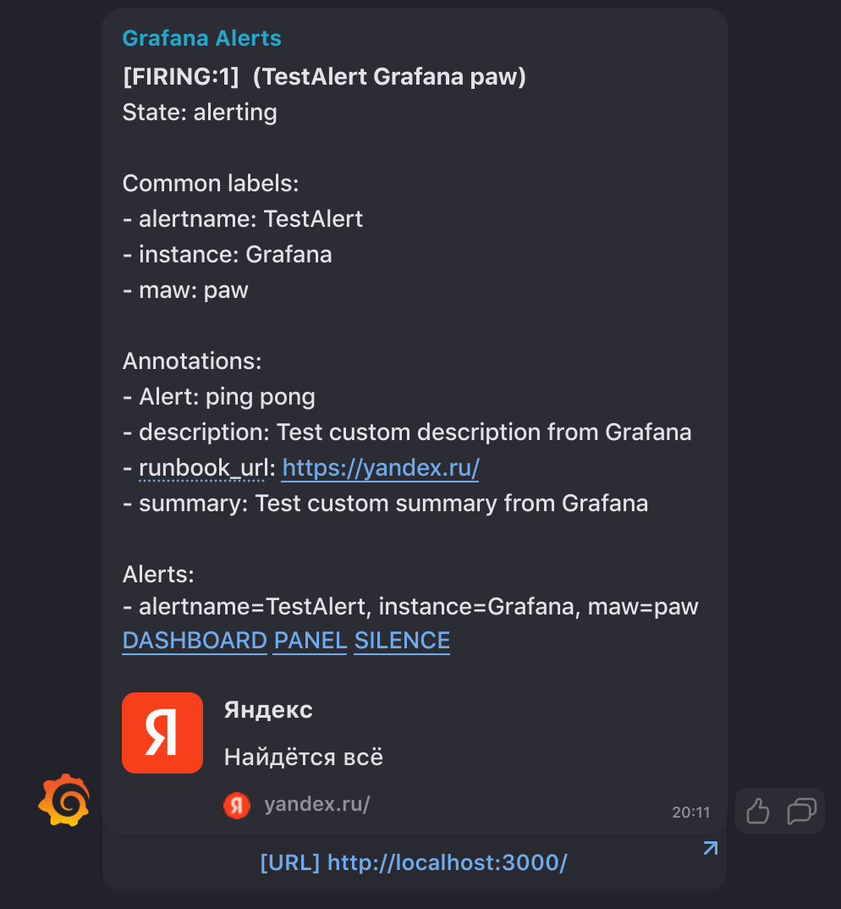
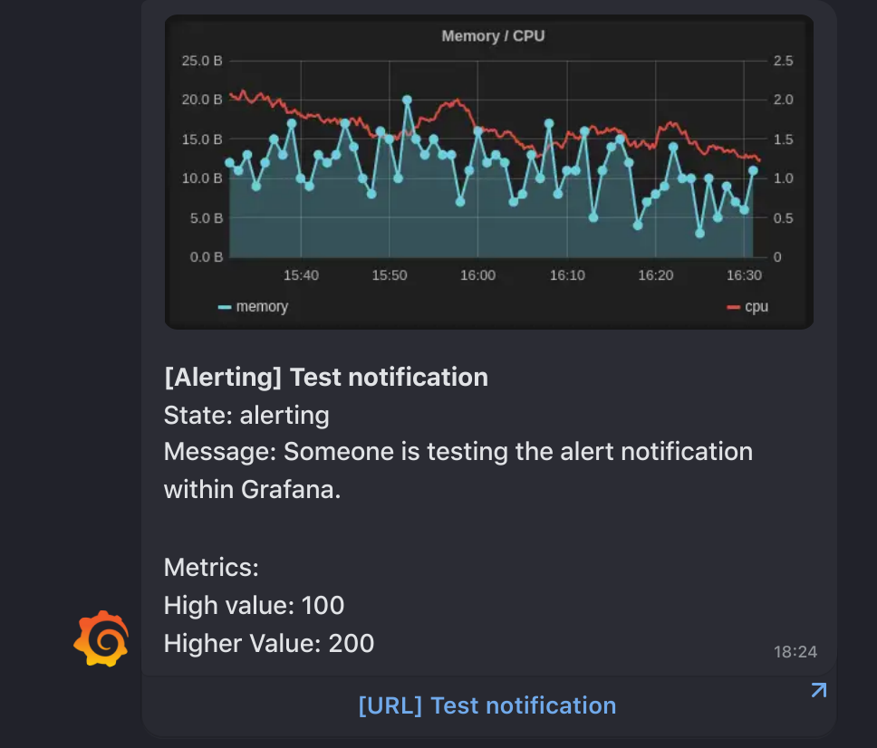

# FastAPI boilerplate для получения вебхуков из Grafana в ICQ/Myteam

Цель данного шаблона - облегчить задачу отправки уведомлений в неподдерживаемые Grafana мессенджеры из коробки. <br><br>
Поддерживаются как Grafana Alerts https://grafana.com/docs/grafana/latest/alerting/unified-alerting/contact-points/#webhook <br>



Так и Legacy Grafana Alerts https://grafana.com/docs/grafana/latest/alerting/old-alerting/notifications/#webhook



# Installing
```
git clone 
cd grafana-hook
pip install -r requirements.txt
```

# Start 

Все необходимые для работы параметры указываются через переменные окружения:

```
API_PREFIX - префикс для path методов FastAPI
TOKEN - токен для бота в ICQ/Myteam
GRAFANA_URL - доменное имя Grafana, будет использоваться в сообщениях
API_URL - URL бот API ICQ/Myteam
GF_LOGIN - логин для авторизации в Grafana
GF_PASSWORD - пароль от Grafana

GF_LOGIN и GF_PASSWORD используются для получения графиков через headless chrome
```


```
uvicorn main:app --host 0.0.0.0 --port 80 --loop=asyncio
```

*--loop=asyncio* - необходимо для запуска асинхронного бота с сессией, так как uvloop невозможно пропатчить

# Examples

Из коробоки в репозитории уже лежит app.middleware.handler.event_handler.

```python

async def event_handler(
        event: Union[OldEvent, NewEvent],
        chatId: str,
        token: Optional[str] = None
) -> Response:
    """
    Функция обработки Event от Grafana
    :param event: Event от Grafana
    :param chatId: ID чата в ICQ/Myteam
    :param token: токен бота (необязательный переметр)
    :return: fastapi.responses.Response
    """

    #  Подменяем токен бота если он был указан,
    #  в противном случае используем указанный в переменной окружения
    if token:
        notifier.token = token
    else:
        notifier.token = os.getenv('TOKEN')

    text = event.to_string()

    print(text)

    keyboard = InlineKeyboardMarkup()

    # Преобразуем эвент в текстовое сообщение
    if isinstance(event, OldEvent):

        keyboard.row(
            KeyboardButton(
                text=f'[URL] {event.ruleName}',
                url=event.ruleUrl
            )
        )
    else:

        keyboard.row(
            KeyboardButton(
                text=f'[URL] {event.externalURL}',
                url=event.externalURL
            )
        )

    if isinstance(event, OldEvent) and event.imageUrl:
        # Если Grafana отправляет в
        # Event ссылку на график - пытаемся его сохранить
        try:
            with tempfile.NamedTemporaryFile(
                    prefix='graphic.', suffix='.png') as upstream:
                async with aiohttp.ClientSession() as session:
                    resp = await session.get(event.imageUrl)

                    upstream.write(
                        await resp.read()
                    )

                await notifier.send_file(
                    chatId=chatId,
                    file_path=upstream.name,
                    caption=text,
                    inlineKeyboardMarkup=keyboard
                )
        except Exception as error:
            await log.exception(error)  # Обрабатываем ошибку
            # если скачать график не удалось

            await notifier.send_text(
                chatId=chatId,
                text=text,
                inlineKeyboardMarkup=keyboard
            )

    else:
        # Если imageUrl не указан - отправляем обычное сообщение
        await notifier.send_text(
            chatId=chatId,
            text=text,
            inlineKeyboardMarkup=keyboard
        )

    return Response()


```

Эта функция обрабатывает входящие Event от Grafana и просто пересылает их в ICQ/Myteam.

Если необходимо другая логика работы с Event или 
работа с другими мессенджарами - нужно переопределить эту функцию и расположить ее в app.event_handler.
!ВАЖНО - функция должна уметь принимать такие же аргументы и возвращать класс Response

# Настройки в Grafana

В Alerting -> Notifications channels при созданиее вебхука 
необходимо указать URL следующего вида:
<br>
<br>
http(s)://GRAFANA-HOOK-URL:PORT/API_PREFIX/{CHAT_ID}
<br><br>
или
<br><br>
http(s)://GRAFANA-HOOK-URL:PORT/{API_PREFIX}/{TOKEN/{CHAT_ID}